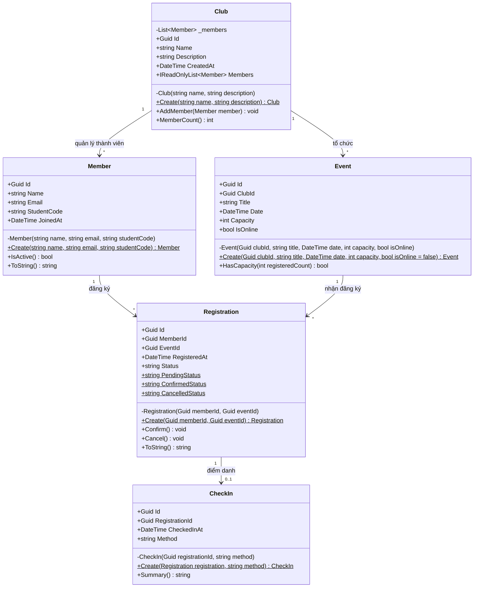

# Sơ đồ lớp — EduHub: Hệ thống tổ chức giải thể thao sinh viên

```mermaid
classDiagram
    class Member {
        +Guid Id
        +string Name
        +string Email
        +string StudentCode
        +DateTime JoinedAt
        -Member(string name, string email, string studentCode)
        +Create(string name, string email, string studentCode)$ Member
        +IsActive() bool
        +ToString() string
    }

    class Club {
        -List~Member~ _members
        +Guid Id
        +string Name
        +string Description
        +DateTime CreatedAt
        +IReadOnlyList~Member~ Members
        -Club(string name, string description)
        +Create(string name, string description)$ Club
        +AddMember(Member member) void
        +MemberCount() int
    }

    class Event {
        +Guid Id
        +Guid ClubId
        +string Title
        +DateTime Date
        +int Capacity
        +bool IsOnline
        -Event(Guid clubId, string title, DateTime date, int capacity, bool isOnline)
        +Create(Guid clubId, string title, DateTime date, int capacity, bool isOnline = false)$ Event
        +HasCapacity(int registeredCount) bool
    }

    class Registration {
        +Guid Id
        +Guid MemberId
        +Guid EventId
        +DateTime RegisteredAt
        +string Status
        +string PendingStatus$
        +string ConfirmedStatus$
        +string CancelledStatus$
        -Registration(Guid memberId, Guid eventId)
        +Create(Guid memberId, Guid eventId)$ Registration
        +Confirm() void
        +Cancel() void
        +ToString() string
    }

    class CheckIn {
        +Guid Id
        +Guid RegistrationId
        +DateTime CheckedInAt
        +string Method
        -CheckIn(Guid registrationId, string method)
        +Create(Registration registration, string method)$ CheckIn
        +Summary() string
    }

    Club "1" --> "*" Event : tổ chức
    Club "1" --> "*" Member : quản lý thành viên
    Member "1" --> "*" Registration : đăng ký
    Event "1" --> "*" Registration : nhận đăng ký
    Registration "1" --> "0..1" CheckIn : điểm danh
```
